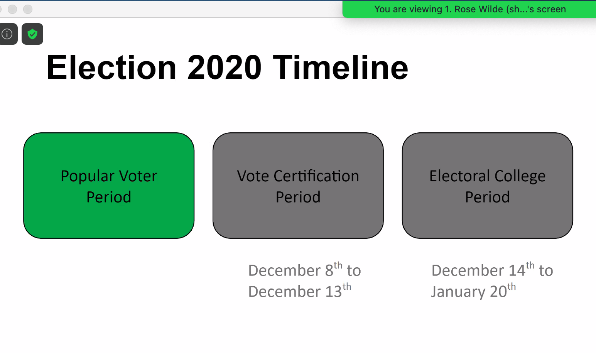
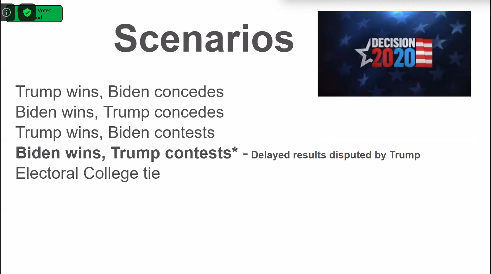
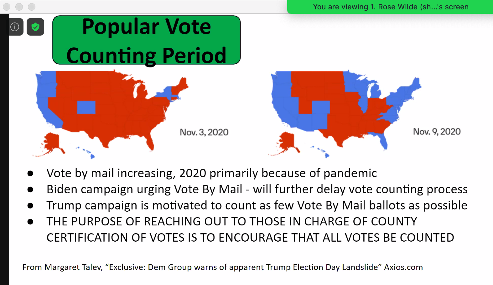
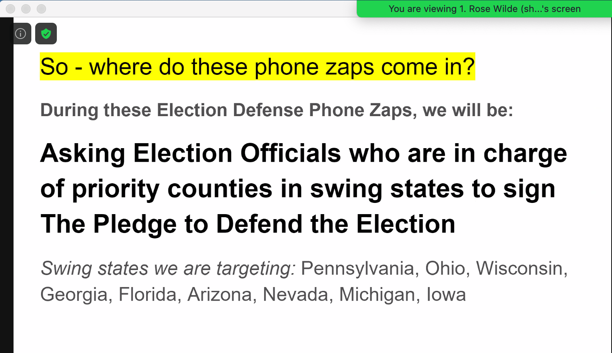

# Group Documents
 - ❇️  **Reference Sheet**
   -  https://docs.google.com/document/d/1UA2kXYYUCq_KNtrhCaK9sFcNL-3HKSrXLzJINK91UvI/
       1.  **Georgia Phone List** - [[link](https://docs.google.com/document/d/1jQMUPVd-GCog5hOK7dWrABEv3DV7n_nvx4xiEGr6zvg/)]
       2.  **Call Scripts** - [[link](https://docs.google.com/document/d/1jQMUPVd-GCog5hOK7dWrABEv3DV7n_nvx4xiEGr6zvg/)]
       3.  **Email Scripts** - [[link](https://docs.google.com/document/d/15DMneYQ5lUufkHHT7FNp8MAb2hbaf8YEueZKr2wSMV8/)]
 - ❇️  **Tracking Form**
   - https://docs.google.com/forms/d/e/1FAIpQLSeJKRESvoFjxMGbPYqgqyOczTo2AM5YBEdVy5xBtiBtf-8aMw/viewform

 > - [ ] **Pledge for Election Officials**
 >   - In Georgia, we are asking the official to sign this pledge:
 >    * https://actionnetwork.org/forms/georgia-county-official-pledge
 > - [ ] **Election Defender Pledge** (for SURJ volunteers)
 >   - https://surj-ed-pledge.netlify.app/election-defender.html

# Introduction
<details>
  <summary>Opening song</summary>


  ```
  Got to fight my amygdala
  Just to keep hearin' ya

  We can do this if we try
  Do this like it's do or die

  let us pause
  let us regroup
  let us remember
  That we are charmed
  ```

  > [Ani DiFranco — Do or Die](https://www.youtube.com/watch?v=quSvEOzZqhI) [YouTube]
</details>

<details>
  <summary>Introduction by Leah Jo</summary>

  > _(pronounced LEE-uh)_
  >
  > _(about 83 people in zoom call at 11:26am)_
  >
  > _(had about 247 actions over the zap hour)_

  one week out from historic election.

  zap is one hour. just calling georgia only.
  someone is putting letters in front of our Zoom name on purpose to organize us into calling groups.

  showing up for SURJ Georgia, New Georgia Project (accountability partner in georgia). best to access zoom on computer so you can use phone to make calls.

  u.s. elections are administered through decentralized counties.
  election officials hold most responsibility to make sure elections are accessible and fair.

  they want to make sure people aren't called too much.

  why georgia? it's a swing state in a long time. when early voting started, there were 8-hr lines. no lines currently, but expected to go up. as of last wed, 2.7 million already voted. both trump and biden are visiting there. 2 open senate seats.

  this is opportunity to swing georgia left. make strides towards more racial justice. we're calling all election officials in georgia today.

  we're using a different script. be respectful and caring in all communications.

  recruit friends to join on Wed and Mon of next week.
</details>

# Instructions
```
you'll be assigned a group by alphabetical letter.
example name and group: L - Tony Le

each volunteer will call the 5 people in the group.

priority is to call first, then leave an email.
```

**if your call gets through:**
 - [ ] do first section of the [Call Script](https://docs.google.com/document/d/1jQMUPVd-GCog5hOK7dWrABEv3DV7n_nvx4xiEGr6zvg/edit).
 - [ ] also follow up with an email.


**if you don't get through:**
 - [ ] don't leave a voice mail.
 - [ ] go to the [Email List](https://docs.google.com/document/d/15DMneYQ5lUufkHHT7FNp8MAb2hbaf8YEueZKr2wSMV8/), copy and paste the 2nd email option. customize the email, then send it.

---

if you reach a receptionist, just ask to leave a message for the election offical. you don't have to pursuade the receptionist.

some people have been called already, that's ok. just say you're following up. be warm and welcoming. we want officials to sign up for the pledge.

you can fill out the tracking form when you're done to give feedback to SURJ and make track that some officials have been called.

SURJ is spreading out the groups to make sure people aren't called too many times. (trying to make sure each election official is called twice.)

(SURJ will update the tracking list to make sure officials who have pledged will get their names blacked out.)


# Background
<details>
  <summary>Background by Rose Wilde</summary>

  now is the time to stop hijacking of election process. trump has suggested he won't respect the process, intimidating voters. since summer, over 10,000 protesters have been arrested.

  democratic participation, we need to hold onto what actions we have left.

  a successful election is one that's free (all eligible voters can vote without interference), transparent, disputes are resolved without bias.

## Election Timeline: 3 Phases
  

  1. popular voter period
  2. voter certification
  3. electoral college period

## Scenarios
  
  Trying to protect against 4th possibility: Biden wins, Trump contests

## Phase 1: Popular Vote counting period
  
  make sure election officials pledge to make sure that all votes are counted.

## Where do phone zaps come in?
  
  we will be asking election officials to sign the Pledge to Defend the Election. swing states targeted: PA, OH, WS, GA...
</details>


# Q & A from SURJ volunteer calls
## Won't sign
Q. one election official won't sign because she said she signed an oath 40 years ago and is always fair. what's the right reponse?

A. we hear that every week, yet the news still reports MANY obstacles in GA and other places. so reviewing their own oath is a good idea anyway! respectfully send an email as follow-up so they have details for our org if they want to contact us.

## If you have feedback
A. Put feedback into tracker form. Make sure to list county, it's easier to organize info that way.

If the official make verbal commitments, SURJ will follow-up, and we can build a relationship of accountability.

## If official says they need to read pledge and/or contact their lawyer
A. Put that feedback on the tracker form. Make sure to put in county and official's name.

